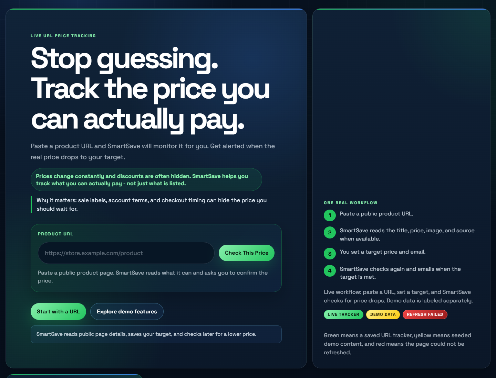
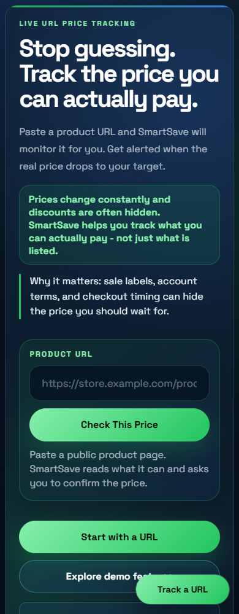

# PricePilot Compare

PricePilot Compare is a static web app for comparing tracked product and service snapshots while factoring in coupons, student pricing, senior deals, and service member discounts.

## Live Demo

[PricePilot Compare](https://christianCorona27.github.io/pricepilot-compare-app/)

## Features

- Search tracked products and equivalent service plans in one interface
- Compare retailer and provider snapshots across Amazon, Best Buy, Walmart, Target, and service providers
- Toggle student, senior, and service member discount profiles
- Apply coupon logic and stack coupons when the provider rules allow it
- Surface current price, regular price, final eligible price, and requirement notes together
- Render dated price history for each provider in the selected comparison
- Filter by products or services and sort by cheapest final price or biggest markdown

## Preview

### Desktop



### Mobile



## Files

- `index.html` - app structure and UI markup
- `styles.css` - layout, visual design, and responsive behavior
- `script.js` - sample data, filtering, discount logic, and rendering

## Run Locally

Since this is a static app, you can open `index.html` directly in a browser.

If you prefer a local server, you can use any simple static server, for example:

```powershell
python -m http.server 8080
```

Then open `http://localhost:8080`.

## How It Works

1. Choose whether the shopper is a student, senior, or service member.
2. Decide whether coupons should be applied.
3. Search the tracked catalog for the same item or an equivalent service plan.
4. Review current price, coupon stacking, eligibility requirements, and dated price history.

## Notes

- Membership discounts do not stack with each other
- Coupons only stack when the provider data says they can
- The included retailer and service data is seeded demo snapshot data
- Real live store search and history collection should be done through server-side adapters and your own history database

## Live Integration Plan

This GitHub Pages build is intentionally using local snapshot data. For production-grade live search:

- Add a backend or serverless layer so API keys are never exposed in the browser
- Query official or approved retailer/provider APIs where available
- Store dated price snapshots in your own database so price history remains available even when the source API only returns current prices
- Normalize item matching, billing cycles, and deal requirements before sending results back to the frontend

